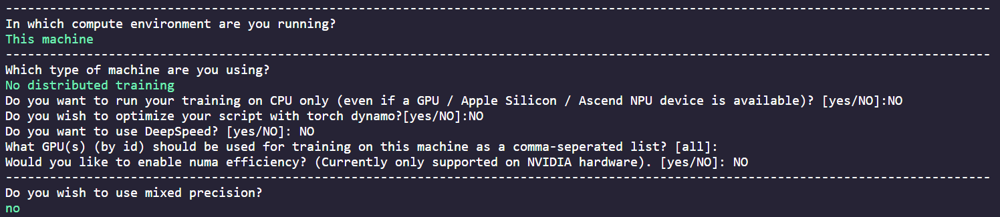

# DLCV Final Project ( Multiple Concept Personalization )

# How to run your code?

- TODO: Please provide the scripts for TAs to reproduce your results, including training and inference. For example,

## training

create a new conda environment using conda3.9.
for example

```shell script=
conda create -n Dlcv_train python=3.9 --yes
conda activate Dlcv_train
```

the execute the train script (at `DLCV-Fall-2024-Final-2-deadlinecv` folder)

```shell script=
bash train.sh
```

**manually configure the accelerate package in the interactive shell** then wait for training.  
example configuration:  


## inference

create another new conda environment using python3.9
for example

```shell script=
conda create -n Dlcv_inference python=3.9 --yes
conda activate Dlcv_inference
```

preparing package

```shell script=
pip install -r requirements.txt
```

the execute the inference script (at `DLCV-Fall-2024-Final-2-deadlinecv` folder)

```shell script=
bash inference.sh <Path to prompts.json file in the data> <output image save directory>
```

example inference command:

```shell script=
bash inference.sh Data/prompts.json results
```

<!--
# Usage
To start working on this final project, you should clone this repository into your local machine by the following command:

    git clone https://github.com/DLCV-Fall-2024/DLCV-Fall-2024-Final-2-<team name>.git

Note that you should replace `<team_name>` with your own team name.

For more details, please click [this link](https://docs.google.com/presentation/d/1eeXx_dL0OgkDn9_lhXnimTHrE6OYvAiiVOBwo2CTVOQ/edit?usp=sharing) to view the slides of Final Project - Multiple Concept Personalization. **The introduction video for final project can be accessed in the slides.**

# Submission Rules
### Deadline
113/12/26 (Thur.) 23:59 (GMT+8)

# Q&A
If you have any problems related to Final Project, you may
- Use TA hours
- Contact TAs by e-mail ([ntudlcv@gmail.com](mailto:ntudlcv@gmail.com))
- Post your question under `[Final challenge 2] Discussion` section in NTU Cool Discussion -->
